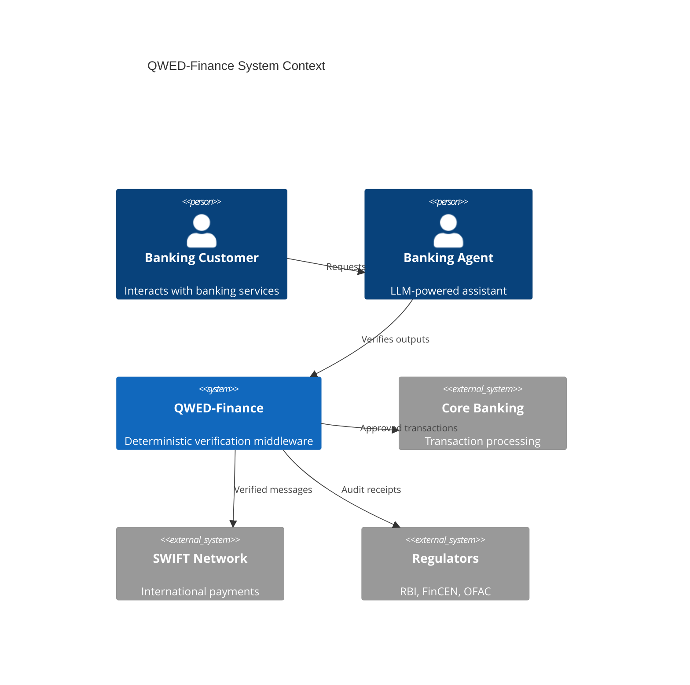
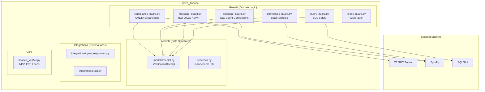
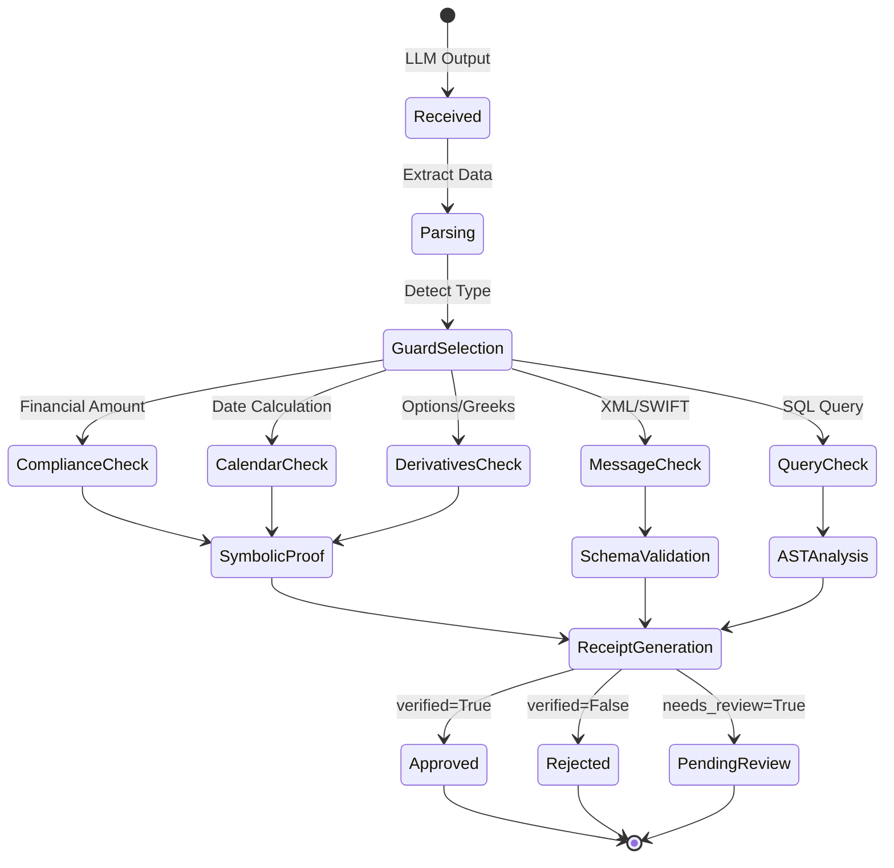
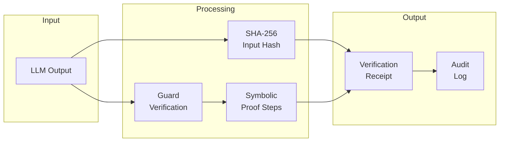
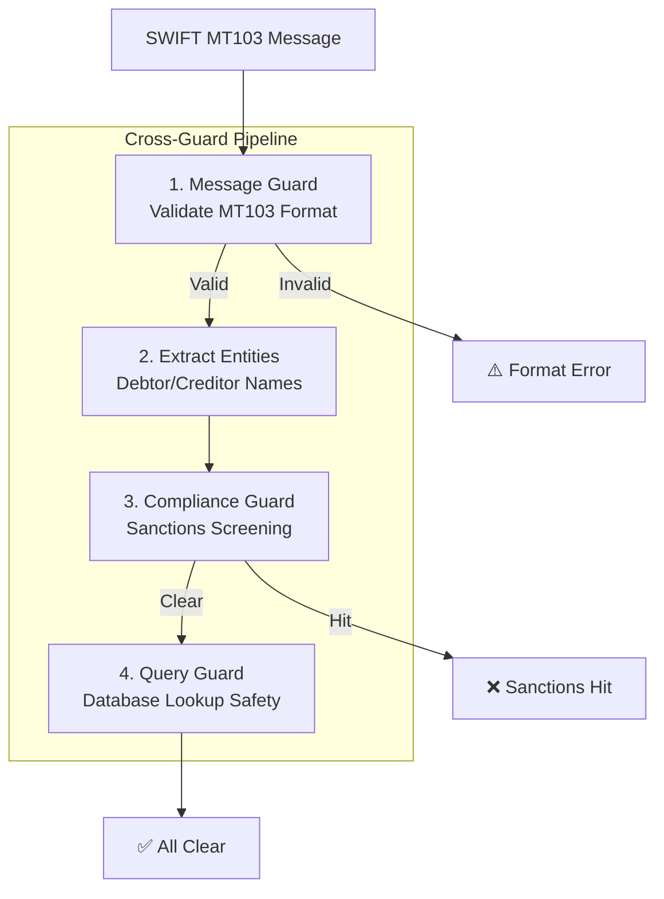
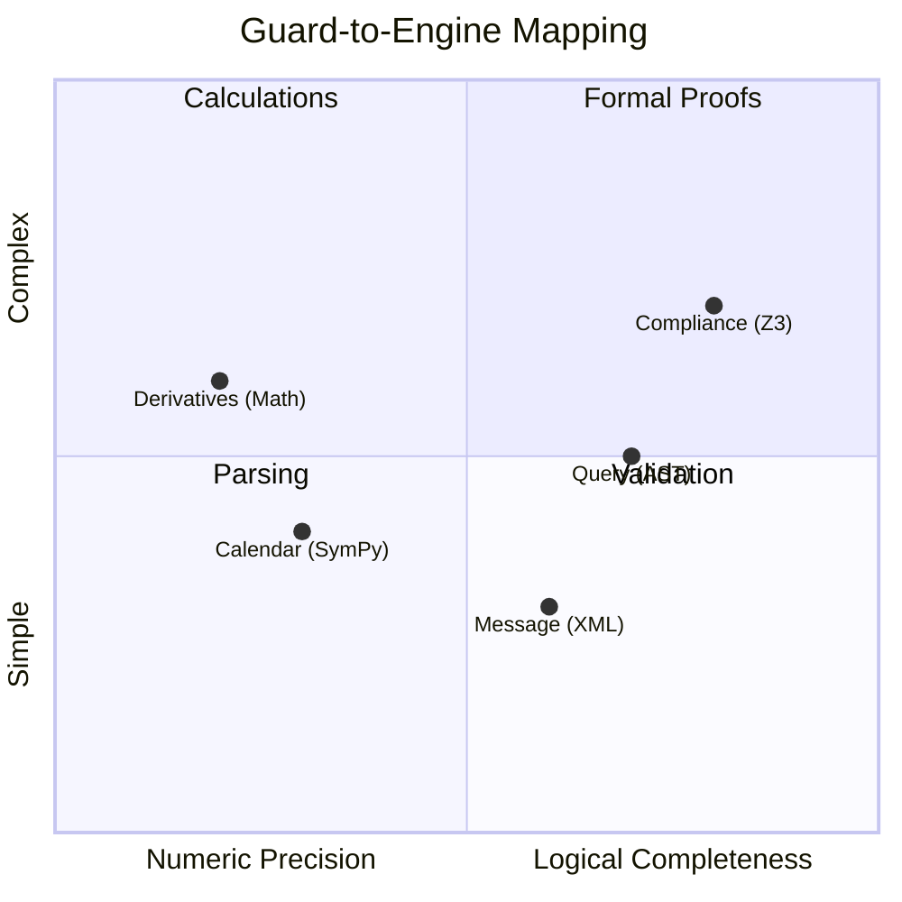
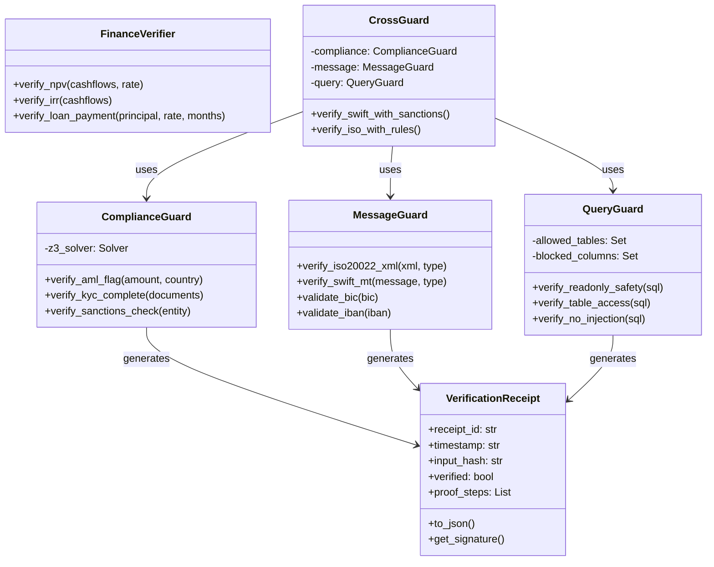
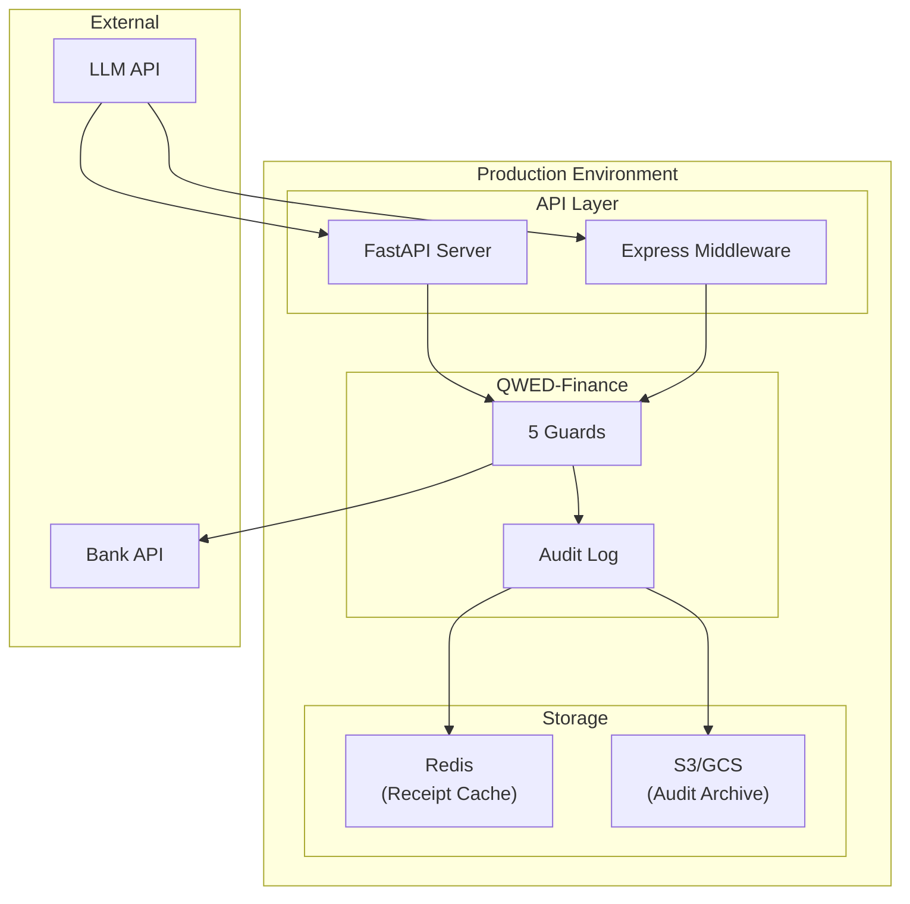

# Design & Architecture

This page provides a deep dive into the internal design of QWED-Finance.

## System Overview

## Guard Architecture

### Component Diagram

## Verification Flow

### State Machine

## Data Flow

### Verification Receipt Lifecycle

### Cross-Guard Pipeline

## Engine Selection Matrix

## Class Diagram

## Deployment Architecture

---

## Design Principles

### 1. Determinism First

Every verification produces the **same result** for the same input. No randomness.

### 2. Symbolic Over Statistical

Use mathematical proofs (Z3, SymPy) instead of probabilistic confidence scores.

### 3. Audit by Default

Every verification generates a receipt. No silent failures.

### 4. Defense in Depth

Cross-Guard combines multiple guards for layered security.

---

## Related Pages

- [Overview](/docs/finance/overview) — Introduction and quick start
- [The 5 Guards](/docs/finance/guards) — Guard implementation details
- [Compliance & Auditing](/docs/finance/compliance) — Receipt and audit log details
