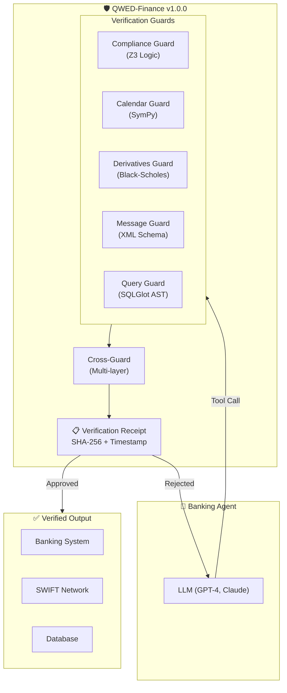
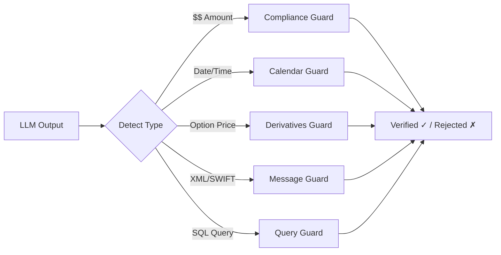
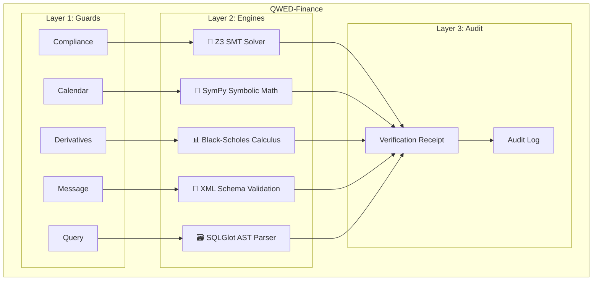
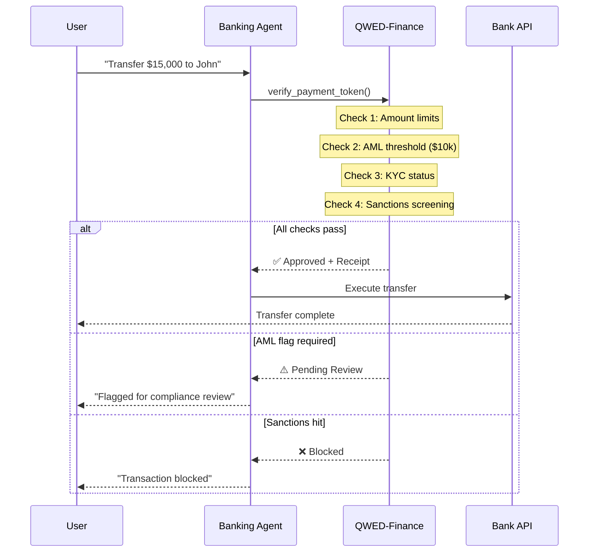

# QWED-Finance

**The Seatbelt for Banking Agents** 🏦

> When an LLM told a customer his Chase card had "$12,889" in rewards, QWED-Finance would have caught the hallucination before it caused a lawsuit.

# QWED Finance (v2.0.1)

**Deterministic Verification for Financial AI**

QWED Finance is a specialized guardrail library designed to prevent financial hallucinations in Large Language Models (LLMs). It uses **Neurosymbolic AI**—combining the flexibility of GenAI with the mathematical certainty of symbolic solvers (SymPy, Z3) and standard financial algorithms.

> **New in v2.0.1:** Added **BondGuard**, **FXGuard**, and **RiskGuard** for institutional-grade analytics.

## Why QWED Finance?

LLMs struggle with basic math and strict logic. In finance, close enough is not good enough.

*   **Problem:** LLM says "IRR is 12%" (when it's actually 11.8%)
*   **Solution:** QWED calculates the *exact* IRR symbolically and either validates or corrects the LLM.

## Key Features

*   ✅ **9 Specialized Guards:** Compliance, Calendar, Derivatives, Messages, ISO, Query, **Bond**, **FX**, **Risk**.
*   ✅ **GitHub Action v2.0:** Integrated CI/CD verifier with SARIF support for security dashboards.
*   ✅ **Audit Trails:** Cryptographic attestation of verification results.
*   ✅ **Zero Hallucination:** Fallback to deterministic engines ensures 100% mathematical accuracy.

## The 4 Pillars of Banking Verification

| Pillar | Guard | Engine | Use Case |
|--------|-------|--------|----------|
| **Calculation** | Finance + Calendar + Derivatives | SymPy | NPV, IRR, Options pricing |
| **Regulation** | Compliance | Z3 | KYC/AML, OFAC sanctions |
| **Interoperability** | Message | XML Schema | ISO 20022, SWIFT MT |
| **Data Safety** | Query | SQLGlot | SQL injection prevention |

## Quick Example

```python
from qwed_finance import ComplianceGuard

guard = ComplianceGuard()

# Verify AML flagging decision
result = guard.verify_aml_flag(
    amount=15000,        # Over $10k threshold
    country_code="US",
    llm_flagged=True     # LLM flagged it
)

print(result.compliant)  # True ✅
print(result.proof)      # "amount >= 10000 → flag required"
```

## Architecture

### High-Level Flow



### Guard Selection Flow



### Verification Engine Stack



### Payment Verification Sequence



## Why Not Just Trust the LLM?

LLMs are **probabilistic**. They can:

- Hallucinate numbers ($12,889 instead of $2.88)
- Miss compliance thresholds (CTR at $10,000.01)
- Generate malformed XML (rejected by SWIFT)
- Create dangerous SQL (DROP TABLE)

QWED-Finance uses **deterministic** verification:

| LLM Output | QWED Verification | Engine |
|------------|-------------------|--------|
| "NPV is $180.42" | SymPy recalculates | Math |
| "Transaction is compliant" | Z3 checks threshold | Logic |
| "Payment XML is valid" | Schema validation | Structure |
| "SELECT * FROM users" | AST analysis | SQL |

## Regulatory Alignment

QWED-Finance aligns with:

- **RBI FREE-AI Framework** (India 2025)
- **BSA/FinCEN** (AML/CTR thresholds)
- **OFAC** (Sanctions screening)
- **ISO 20022** (Payment messaging)

> "Accuracy alone is not sufficient - transparency, auditability, and defensible decision logic are required." — India AI Governance Guidelines

## Next Steps

- [The 5 Guards](/docs/finance/guards) - Deep dive into each verification guard
- [Compliance & Auditing](/docs/finance/compliance) - Receipts and regulatory proof
- [Integrations](/docs/finance/integrations/ucp) - Connect with UCP and Open Responses
