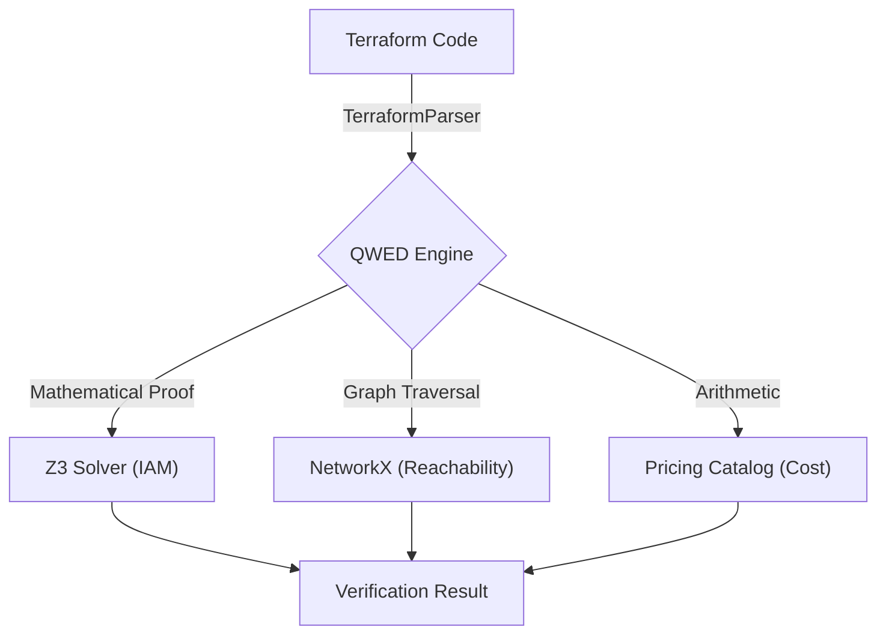

# QWED-Infra ☁️

**Deterministic Verification for Infrastructure as Code (IaC)**


`qwed-infra` is a Python library that uses **Formal Methods (Z3 Solver)** and **Graph Theory** to mathematically prove the security and compliance of detailed infrastructure definitions (Terraform, AWS IAM, Kubernetes). 

It prevents AI agents (like Devin or Copilot Workspace) from deploying insecure or expensive infrastructure by verifying configuration *before* deployment.

## 🎯 Architecture



## 🚀 Key Features

### 🛡️ IamGuard
Verifies AWS IAM Policies using the **Z3 Theorem Prover**. Instead of regex matching, it converts policies into logical formulas to prove reachability and specific permissions.

### 🌐 NetworkGuard
Verifies Network Reachability using **Graph Theory** (NetworkX). Validates paths like `Internet -> IGW -> Route -> Security Group -> Instance`.

### 💰 CostGuard
Deterministic Cloud Cost estimation before deployment. Enforce budgets and prevent expensive instance provisioning errors.

## 📦 Installation

```bash
pip install qwed-infra
```
