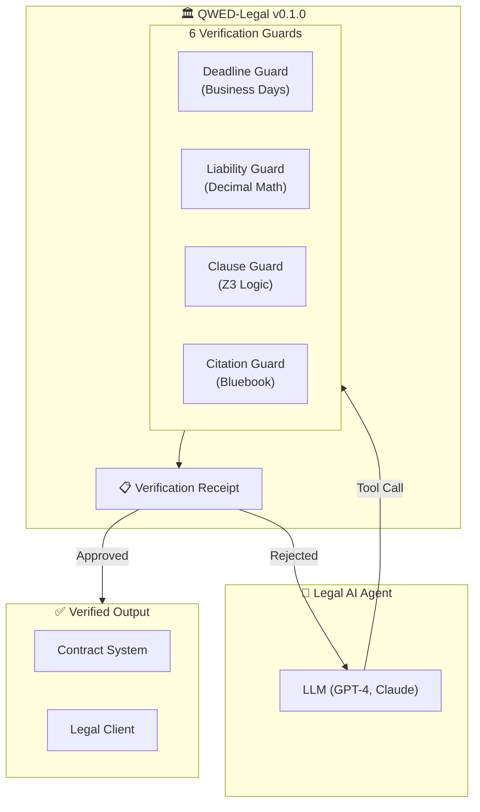
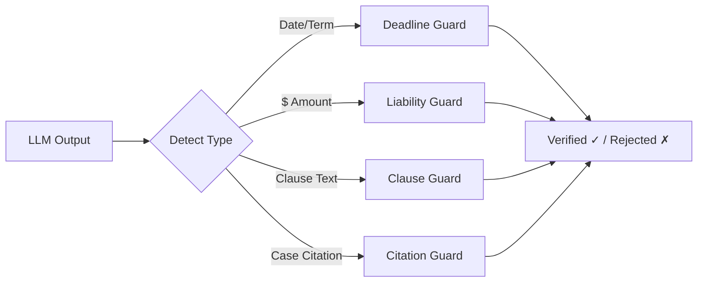

# QWED-Legal

**The Paralegal for AI-Powered Contract Review** 🏛️

> When lawyers used ChatGPT and cited 6 fake court cases (Mata v. Avianca), QWED-Legal would have caught them before the $5,000 fine.

## What is QWED-Legal?

QWED-Legal is a deterministic verification layer for AI-generated legal document analysis. It catches:

- **Date calculation errors** (30 business days miscalculated)
- **Contradictory clauses** (Clause A says X, Clause B says Not X)
- **Liability miscalculations** (200% of $5M ≠ $15M)
- **Hallucinated citations** (fake case names, invalid reporters)

```bash
pip install qwed-legal
```

## The 6 Guards of Legal Verification

| Guard | Engine | Use Case |
|-------|--------|----------|
| **DeadlineGuard** | python-dateutil + holidays | Business days, leap years, jurisdiction holidays |
| **LiabilityGuard** | Decimal + SymPy | Cap %, tiered liability, indemnity limits |
| **ClauseGuard** | Z3 SMT Solver | Contradiction detection, termination conflicts |
| **CitationGuard** | Regex + Bluebook | Case citations, reporter validation |
| **JurisdictionGuard** | Rule-based logic | Choice of law, forum selection, CISG |
| **StatuteOfLimitationsGuard** | Date calculations | Claim periods by jurisdiction |

## Quick Example

### Verify a Deadline Calculation

```python
from qwed_legal import DeadlineGuard

guard = DeadlineGuard()
result = guard.verify(
    signing_date="2026-01-15",
    term="30 business days",
    claimed_deadline="2026-02-14"  # LLM claimed this
)

print(result.verified)   # False!
print(result.computed_deadline)  # 2026-02-27 (correct)
# ❌ ERROR: Deadline mismatch. Expected 2026-02-27, but LLM claimed 2026-02-14.
```

### Verify a Legal Citation

```python
from qwed_legal import CitationGuard

guard = CitationGuard()
result = guard.verify("Brown v. Board of Education, 347 U.S. 483 (1954)")

print(result.valid)  # True - valid Bluebook format
print(result.parsed_components)
# {'plaintiff': 'Brown', 'defendant': 'Board of Education', 'volume': 347, 'reporter': 'U.S.', 'page': 483, 'year': 1954}
```

## Architecture

### High-Level Flow



### Guard Selection Flow



## Audit Log: Real Hallucinations Caught

| Contract Input | LLM Claim | QWED Verdict |
|----------------|-----------|--------------|
| "Net 30 Business Days from Dec 20" | Jan 19 | 🛑 **BLOCKED** (Actual: Feb 2) |
| "Liability Cap: 2x Fees ($50k)" | $200,000 | 🛑 **BLOCKED** (Actual: $100,000) |
| "Seller may terminate with 30 days notice" + "Neither party may terminate before 90 days" | "Clauses are consistent" | 🛑 **BLOCKED** (Conflict detected) |
| "Smith v. Jones, 999 FAKE 123" | Valid citation | 🛑 **BLOCKED** (Unknown reporter) |

## Why Not Just Trust the LLM?

LLMs are **probabilistic**. They can:

- **Hallucinate case citations** (Mata v. Avianca scandal)
- **Miscalculate business days** (ignore holidays, weekends)
- **Miss contradictory clauses** (termination notice vs minimum term)
- **Get percentage math wrong** (200% of $5M ≠ $15M)

QWED-Legal uses **deterministic** verification:

| LLM Output | QWED Verification | Engine |
|------------|-------------------|--------|
| "Deadline is Feb 14" | Calculate business days | python-dateutil |
| "Liability cap is $15M" | Decimal math | SymPy |
| "Clauses are consistent" | Z3 satisfiability | Z3 SMT |
| "Citation is valid" | Bluebook regex | Pattern matching |

## Jurisdiction Support

DeadlineGuard supports jurisdiction-specific holidays:

```python
from qwed_legal import DeadlineGuard

# US holidays (default)
us_guard = DeadlineGuard(country="US")

# UK holidays
uk_guard = DeadlineGuard(country="GB")

# California-specific holidays
ca_guard = DeadlineGuard(country="US", state="CA")
```

## Next Steps

- [The 6 Guards](/docs/legal/guards) - Deep dive into each verification guard
- [Examples](/docs/legal/examples) - Real-world contract verification scenarios
- [Troubleshooting](/docs/legal/troubleshooting) - Common issues and solutions
