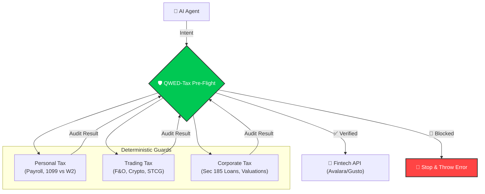

# QWED-Tax: Overview

> "Death, Taxes, and Deterministic Verification."

**QWED-Tax** is the deterministic verification layer for Agentic Finance. It protects AI Agents from making costly tax errors by proofing inputs against **IRS (US)** and **CBDT (India)** rules before any transaction is executed.

## 🚨 The Problem
AI agents (LLMs) are handling payroll and tax, but they are largely illiterate in tax law. They hallucinate rates, misclassify workers, and ignore nexus thresholds.

### Real World Failures
| Scenario | LLM Hallucination | QWED Verdict |
| :--- | :--- | :--- |
| **Worker Hire** | "Hiring contractor (1099) who uses my laptop" | 🛑 **BLOCKED** (Misclassification Risk) |
| **Sales Tax** | "No tax in NY for $600k sales" | 🛑 **BLOCKED** (Nexus Violation) |
| **Payroll** | "FICA Tax on $500k = $31,000" | 🛑 **BLOCKED** (Limit is $176k / ~$10k tax) |

## 🧾 Accounts Payable (AP) Automation
`qwed-tax` now secures the entire "Procure-to-Pay" cycle for AI Agents:
*   **Validation:** Checks GSTIN/VAT ID formats.
*   **Compliance:** Blocks Input Tax Credit (ITC) on "Personal" categories (Food, Cars, Gifts).
*   **Withholding:** Auto-calculates TDS/Retention amounts before commercial payment.

## 🧠 Procedural Accuracy (MSLR Aligned)
Unlike standard calculators, `qwed-tax` verifies the **procedure**, not just the result. This aligns with **Multi-Step Legal Reasoning (MSLR)** to prevent "Right Answer, Wrong Logic" errors.

*   **Step 1: Sanction Check** $\rightarrow$ Is this transaction legal? (e.g., `RelatedPartyGuard` blocks illegal loans *before* rate checks).
*   **Step 2: Limit Check** $\rightarrow$ Is it within quota? (e.g., `RemittanceGuard` checks LRS limit *before* TCS).
*   **Step 3: Calculation** $\rightarrow$ Apply math.

## 🏗️ Architecture: The "Swiss Cheese" Defense
QWED-Tax acts as the **Pre-Flight Middleware** between your AI Agent and Fintech APIs (like Gusto, Stripe, or Avalara).



## 🔒 Zero-Data Leakage
Unlike cloud APIs check (Avalara/Vertex), `qwed-tax` runs **100% Locally**.
*   **Privacy First:** Your payroll/trading data never leaves your server.
*   **No API Latency:** Checks are instant (microseconds).
*   **GDPR/DPDP Compliant:** Ideal for sensitive Fintech environments.

## 📦 Installation

```bash
pip install qwed-tax
```
