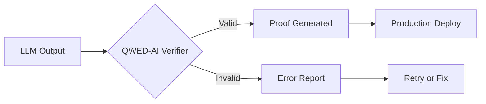

<Callout kind="info" title="Starter Kit Template">
  This documentation was generated as a starter kit template based on your brand. Please review and customize the content to accurately reflect your product's features, APIs, and capabilities.
</Callout>

## Overview

QWED-AI provides an open-source verification protocol that deterministically proves the correctness of large language model (LLM) outputs. You can use it to bridge the trust gap in AI applications, especially in high-stakes domains like finance, code generation, and scientific computing. By generating mathematical proofs and logical validations, QWED-AI ensures your LLM results are production-ready without relying on probabilistic confidence scores.

The protocol integrates seamlessly with your existing LLM pipelines, adding a layer of verifiable certainty. Whether you are verifying mathematical equations, logical reasoning chains, financial calculations, or code snippets, QWED-AI delivers reproducible proofs that stand up to scrutiny.

## Key Features

QWED-AI excels in specialized verification domains. Explore the core capabilities below.

<Columns cols={2}>
  <Card title="Math Verification" icon="calculator">
    Validate complex equations and proofs with step-by-step deterministic checks. Supports algebra, calculus, and symbolic math.
  </Card>
  <Card title="Logic Verification" icon="brain">
    Prove logical statements, theorem provability, and reasoning chains using formal verification techniques.
  </Card>
  <Card title="Finance Verification" icon="trending-up">
    Ensure accuracy in risk models, pricing algorithms, and compliance calculations with auditable proofs.
  </Card>
  <Card title="Code Verification" icon="code">
    Verify code snippets for correctness, security vulnerabilities, and performance guarantees before deployment.
  </Card>
</Columns>

## How QWED-AI Works



This simple flow demonstrates how QWED-AI processes LLM outputs: it analyzes the content, runs specialized verifiers, and produces either a proof or an actionable error.

<Callout kind="tip">
  Start with simple verifications like basic math to familiarize yourself with the protocol.
</Callout>

## Quick Start

Get up and running in minutes.

<Steps>
  <Step title="Install QWED-AI" icon="download">

    Install the Python package from PyPI.

    <CodeGroup tabs="pip,poetry">
      ```bash
      pip install qwed
      ```

      ```bash
      poetry add qwed
      ```
    </CodeGroup>

  </Step>
  <Step title="Verify Your First Output" icon="play">

    Create a simple verification script.

````python
from qwed import Verifier

# Verify a math statement
verifier = Verifier(domain="math")
result = verifier.verify("2 + 2 = 4")

print(result.proof)  # Outputs deterministic proof
print(result.is_valid)  # True
```
````

  </Step>
  <Step title="Integrate with LLM" icon="zap">

    Hook it into your LLM pipeline.

    ```python
    llm_output = "The integral of x dx is x^2/2 + C"
    result = verifier.verify(llm_output)
    if result.is_valid:
        deploy_to_production(result.proof)
    ```

  </Step>
</Steps>

## Benefits for Production

- **Trustworthy AI**: Eliminate hallucinations with hard proofs.
- **Compliance Ready**: Meet regulatory requirements in finance and healthcare.
- **Scalable**: Handles high-volume verifications via Docker and cloud deployments.
- **Open Source**: Fully auditable code with community contributions.

## Next Steps

<Columns cols={3}>
  <Card title="Quickstart Guide" icon="rocket" href="/quickstart">
    Install and run your first verification in under 5 minutes.
  </Card>
  <Card title="Authentication" icon="shield" href="/authentication">
    Secure your API calls with tokens and keys.
  </Card>
  <Card title="Advanced Guides" icon="book-open" href="/changelog">
    Explore changelog for latest features and updates.
  </Card>
</Columns>

<Callout kind="success">
  Ready to verify? Head to the [Quickstart](/quickstart) to begin.
</Callout>